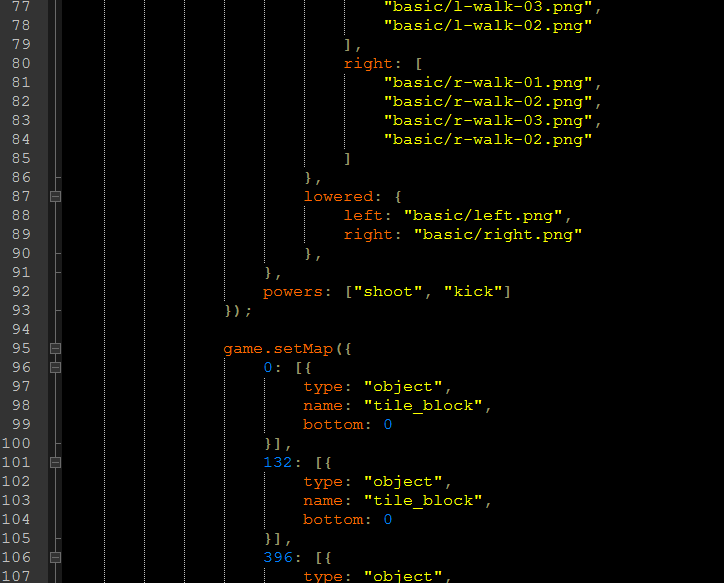

# Adventures of anyone
Um principio de jogo de Mario multiplayer, não tem monstros.

## Coisas que foram planejadas no inicio do projeto:
Um código que através deste fosse possível criar um jogo de mario e pudesse ser jogado através de socket, com duas pessoas, contando com:
Objetos colidiveis.
 * Heói e ajudante do héroi, capazes de andar e pular, considerando que podem ter formas diferentes ou iguais.
 * Objetos coletaveis, que te garantiriam algum tipo de vantagem durante o jogo ou a conclusão deste.
 * Monstros que se movimentassem e fossem capazes de matar o heroi ou seu ajudante.
 * Possibilidade de criar uma conexão via socket, se forma que o ajudante e o heroi pudessem jogar em computadores diferentes sem a necessidade de compartilharem o mesmo teclado.
 * Consigurar as teclas as quais o jogador desejaria pressionar para executar cada ação de seu personagem.

# Objetivos completados:
 * Objetos colidiveis.
 * Heói e ajudante do héroi, capazes de andar e pular, considerando que podem ter formas diferentes ou iguais.
 * Possibilidade de criar uma conexão via socket, se forma que o ajudante e o heroi pudessem jogar em computadores diferentes sem a necessidade de compartilharem o mesmo teclado.

## Descrição do código:
## GAME:
É uma class-namespace que contém classes privadas, entre elas estão as classes: object, heroform e map, essas três classes tem seus objetos criados através dos métodos publicos addObject, addHeroForm e setMap do objeto da classe Game.

Ela trabalha com dois elementos HTML5 CANVAS, um criado virtualmente no javascript e outro criado “fisicamente” no html, que é visivel para os jogadores.
O método run() da classe game roda o jogo, verificando se há movimento sendo solicitado da parte dos jogadores e se esses movimentos irão fazer com que haja uma colisão com X elemento dentro do ambiente, cada elemento que é verificado é depois colocado através do método draw() é o responsável por desenhar os objetos que já foram verificados no canvas virtual, depois que todos as imagens estiverem desenhadas no canvas virtual, o canvas virtual é passado para o canvas fisico, através do metodo privado flush().
A classe Game também é responsável por ler comandos locais (teclas pressionadas pela pessoa que estiver diante do computado ao qual o jogo está rodando) e também ler informações de socket que são recebidas (a conexão de um segundo jogador ou os comandos dele dentro do jogo).
Quando um servidor do jogo é criado, todas as informações são calculadas dentro do browser de quem criou o servidor e então as informações de onde cada elemento se encontra na tela são enviadas via socket para o ajudante, do lado do ajudante a classe Game lê as informações recebidas e expressa elas.

## ENVIRONMENT:
Essa classe-namespace é responsável por calcular colisões entre elementos retangulos, a classe recebe os valores X, Y, WIDTH e HEIGHT de cada retângulo do jogo.
Dentro da classe Environment há a classe Rectangle, da qual saem cada rectangulo e são colocados em um array da classe Environment, assim que todos os retângulos do cenário são definidos, se houver movimentação entre os retângulos, um algoritmo de analise de colisão é acionado:
A classe Rectangle conta com os métodos pointIsInside({ x: 10, y: 10 }), rectangleIsCrossed(rectangleObject) para verificar se há alguma coisa dentro do retangulo.
Para verificar se haverá colisão depois da movimentação de um retângulo, o método willICollide() da classe Enviroment é chamado, ele cria uma simulação de como o retângulo estará depois da movimentação e verifica se essa simulação colide com algum retângulo que não seja aquele que ele está simulando, se a simulação colidir com um ou mais retangulo que o original ainda não tenha colidido, então é verificado qual é a distancia entre os dois retangulos; quando todos estiverem verificados, as novas colisões são passadas por array e também o valor da menor distância, dessa forma quando o retangulo for se aproximar, ele vai se aproximar apenas o necessario e não mais do que isso, como pode ser visto na imagem abaixo:

## IMAGELOADER:
Essa classe é a classe pai da classe Player e da classe Object, através dela é possível carregar as imagens para dentros do jogo.
Bug: uma vez que não foi utilizado 100% do potencial desta classe, o jogo tende a iniciar sem que o herói apareça, isso acontece por que o jogo começa a calcular as colisões antes que essa classe tenha terminado de carregar as imagens, logo, será calculado que o heró não está pisando em local nenhum e então vai atravessar o chão caindo num abismo infinito.
O bug é corrigido atualizando-se a página.

## KEYBOARD:
Essa classe indica como cada tecla deve ser interpretada pela classe player.

## HEROFORM:
Essa classe apresenta para o herói quais imagens pertencem à ele, qual a velocidade dele e capacidade de pulo.

## PLAYER:
Uma classe pai das classes Hero e Helper, ela apresenta em qual situação que o jogador está (pulando, abaixado, caindo, correndo, parado), administra a classe KeyBoard e HeroForm.

## OBJECT:
A classe object simplesmente recebe imagens da classe IMAGELOADER e as administra.

## MAP:
A classe Map recebe as informações passadas no código no formado de JSON indicando quais são os objetos a serem colocados no jogo e quais são suas posições X e Y dentro do jogo.
Essa classe passa para a classe game o pedaço do mapa que lhe for solicitada, através do método getBetween(x, x).
O método publico getBetween aciona dois métodos privados da classe Map, o método maxSelect e minSelect, considere o seguinte mapa:
 

Considerando que minSelect(30) seja executado, o código fará o seguinte:

O x30 está entre esses dois elementos, quando a próxima verificação fosse feita e não fosse encontrado ninguém no meio, então o menor dos dois elementos seriam declarados como X30, no caso, o X25.
O método privado maxSelect faz a mesma coisa que o minSelect, só que ele sempre define o maior elemento do meio como sendo o meio que divide os dois lados e também quando só houverem mais dois elementos, o maior será o que é procurado, se maxSelect for executado nesse contexto, X40 será o retorno.
Trabalhando dessa forma se garante muita velocidade para encontrar os elementos dentro do mapa, quando getBetween(200, 500) é executado, uma fatia do mapa é recortada utilizando os dois métodos acima e apenas as coisas que o usuário verá que terão valores de colisão calculados e imagens expressas evitando calculos desnecessários na memória e envio de informações inuteis via socket.

## GAMESERVER
Essa classe fica dentro do servidor Node, ela é responsável apenas por administrar qual o servidor, qual a senha, se o Hero já está conectado com o Helper e transmitir os sockets de um lado para o outro.
